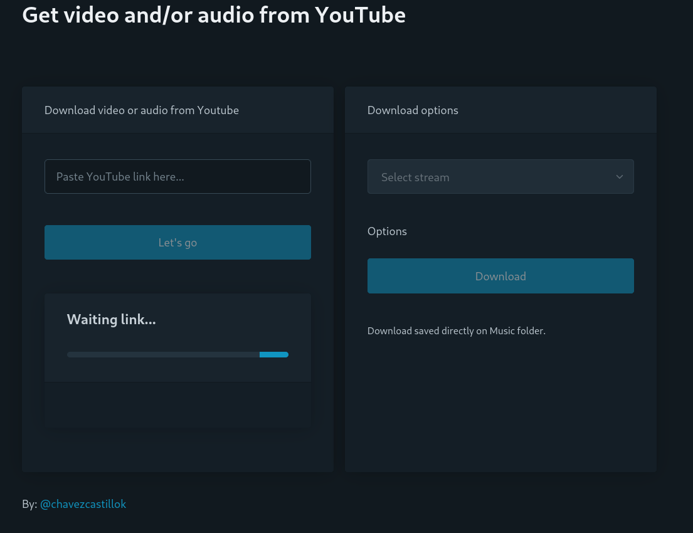

# Get from YouTube

Get video and/or audio from YouTube. Web-UI for **pytube** using **eel**.

## Running from source code

Download it, and open terminal in source code folder and runs the main program:

```bash
$ python main.py
```

And, it will be ready to use.

## How to use Web-UI



1. Paste the _YouTube link_ on text input
2. Click on _Let's go_ button, appear the video title and author
3. Select stream to see download options
4. Select one between the available options
5. Click on Download button
6. Wait while your download finished
7. And, ready! the video or audio will be avalible on the system Music folder (on Linux and Windows).

### Notes

- Fully functional code, tested on Fedora Linux. You should have no problems using it on Windows/Mac.

- Executables for each system will be provided in future updates.

> By: [@chavezcastillok](https://chavezcastillok.github.io/)
